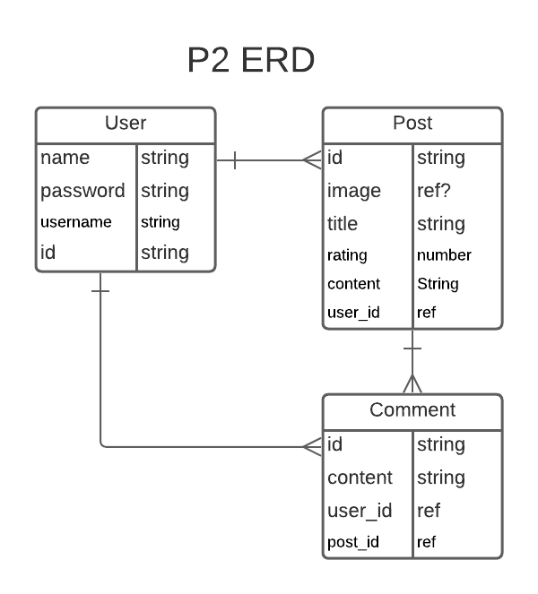
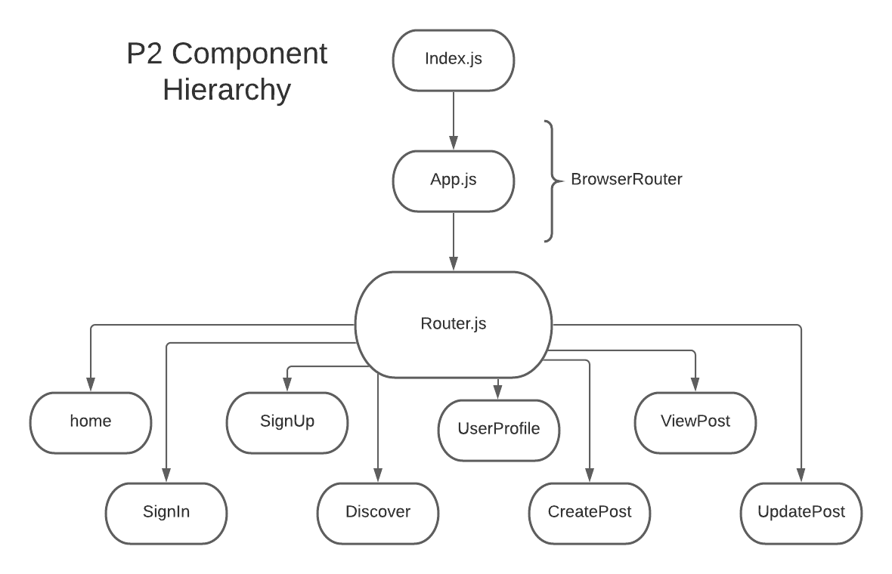

# Untitled Project 2

## November 9, 2020

### By: Mark DeVito

[Github](https://github.com/markdv123) | [LinkedIn](https://www.linkedin.com/in/markdv123/)
***

### :video_game: Overview :video_game:

This app serves as a social media site for gamers to record and share their experiences with specific video games. Users can make posts detailing their views about a game, including a personal rating, image, and description. Like other social media sites, fellow users will be able to comment on these posts. Being able to consolidate one's play history and opinions could be beneficial to twitch streamers and game hobbyists who wish to share their recommendations effectively. 
***

### :computer: Technologies Used :computer:

* React
* Express
* Node
* HTML/CSS/JavaScript
* Mongoose
* MongoDB
***

### ERD

***

### Component Hierarchy

***

### :memo: Planned Improvements :memo:

- [ ] Carousel option for adding several images to a post
- [ ] Ability to disable comments on your post
- [ ] User profile customization: profile pic, background pic, description with space to link discord/twitch/twitter
***

### :alien: Credits :alien:
- There will be credits here once i know everything i need to credit :see_no_evil: :hear_no_evil: :speak_no_evil: